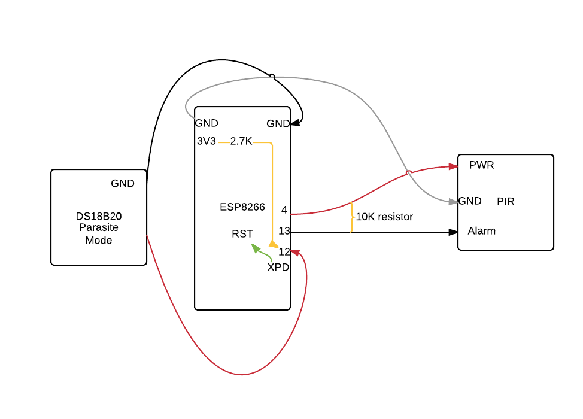

ESP8266 Occupancy Sensor
=========================

1. Download the Arduino toolchain and development environment

    1. http://arduino.cc/en/Main/Software

2. Download the Exosite Arduino Library from the Arduino Library Manager (Sketch->Include Library->Manage Libraries->Search for "Exosite")

3. Open "File->Examples->arduino_exosite_library->ESP8266OccupancySensor"

4. Edit the SSID and password to correspond to an in-range WiFi network.

5. Connect your ESP8266 to your computer using a USB cable. This program was tested using this one: https://www.sparkfun.com/products/9873

	1. The Sparkfun ESP8266 Thing was used to test this example

6. Connect the PIR Motion Sensor to the ESP8266.

	1. You may need to modify the PIR Motion Sensor as done in this community form post: https://community.exosite.com/t/esp8266-wifi-occupancy-sensor/142

7. Connect the Dallas Temperature DS18B20 to the ESP8266 in Parasite Power mode and download the [Dallas Temperature](https://github.com/milesburton/Arduino-Temperature-Control-Library) and [OneWire](http://playground.arduino.cc/Learning/OneWire) libraries. The Dallas Temperature library can be found in the Arduino Library Manager, the OneWire library must be manually installed.

8. Go to "Tools->Serial" to select the serial port your Arduino board is connected to

9. Download and install the ESP8266 library following the instructions here: https://github.com/esp8266/Arduino

	1. You MUST use the staging version of the ESP8266 library (or the stable version if newer than Aug 10, 2015) so that method strtoul is compatible

10. Go to "Tools->Board" to select the Sparkfun ESP8266 Thing
 
11. In the Arduino software, compile and verify there are no errors

12. Upload the program to your board.

13. When "Done uploading" is displayed, sign up for a free account at https://portals.exosite.com.

14. Go to the Devices page (https://portals.exosite.com/manage/devices) and add a device

	1. Click on "+ Add Device"

	2. Select "Select a supported device below" and select "Arduino Yún Compatible."

	3. Enter the MAC Address by looking at the serial monitor where it is printed out after you've flashed the ESP8266 with this example firmware, enter your timezone, and optionally add a location. You may also limit the resources your device may use.

	4. Name your device.

15. Click on the device you just created to open the Device Information window.

16. Add the three datasources "temp", "occupancyint", and "occupancy". (For Each)

	1. Click "+ Add Data"

	2. Give your dataports a human readable name (eg. "Temperature", "Motions Detected" and "Occupied?"), set all three to format "integer", set the alias ("temp", "occupancyint" and "occupancy").

17. Create some Lua script datarule of your own design to set the amount of motions detected in an interval result in an "occupied" room. See the community form post above for an example.

For more information on this project and other examples, checkout our Exosite Garage github page at http://exosite-garage.github.com

Schematic
=========
