Exosite Arduino Yún Quick Start
====================================
###Summary
The Arduino Yún is an open hardware platform that combines an Arduino with a mini Linux computer that handles the WiFi / Ethernet Networking interfaces.  More information can be found here: [Arduino Yún](https://www.arduino.cc/en/Main/ArduinoBoardYun).  

The Exosite Arduino Library is provided to help developers quickly evaluate Exosite technologies and build useful connected things.

## Instructions
### Installing Arduino IDE / Exosite Library

1. Download the Arduino toolchain and development environment

    * [http://arduino.cc/en/Main/Software](http://arduino.cc/en/Main/Software)

2. Install the Exosite Arduino Library from the Arduino Library Manager (Sketch->Include Library->Manage Libraries->Search for "Exosite")

	

	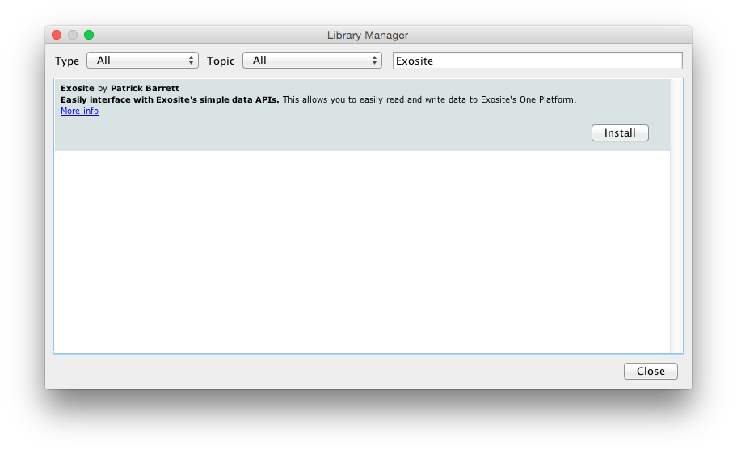

### Configure your Yún's networking
11. Power your Arduino Yún using the USB cable connected to your computer or using a power adapter and follow the Yún instructions for connecting to your network WiFi or connect an Ethernet cable.  [Arduino Yún Getting Started -- WiFi Configuration](https://www.arduino.cc/en/Guide/ArduinoYun#toc14)

    * Note: The Yun, if connected by Ethernet can be found by going to [arduino.local](arduino.local) in your web browser - although recommend using the [Arduino Yun WiFi Configuration Guide](https://www.arduino.cc/en/Guide/ArduinoYun#toc14).

   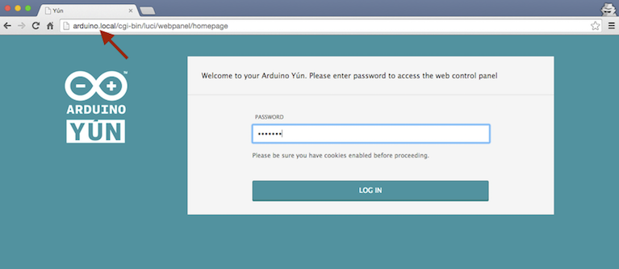
   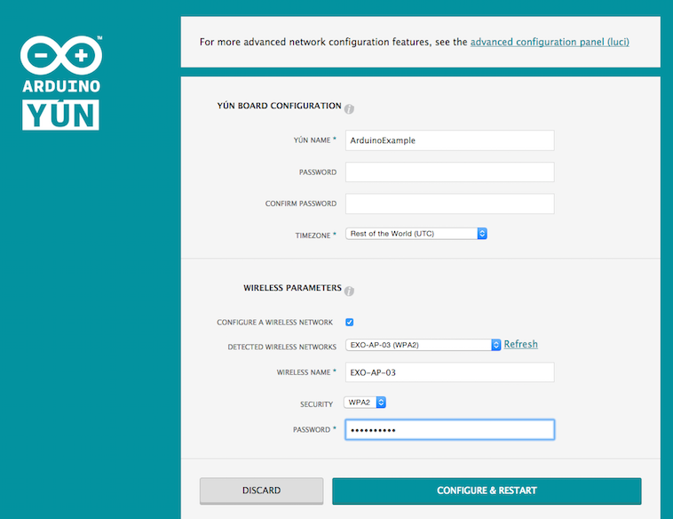
 

### Set up your Yún on Exosite's Portals Visualization Tool 

5. Sign up for a free account at [https://portals.exosite.com](https://portals.exosite.com).  This will include an email verification process.
 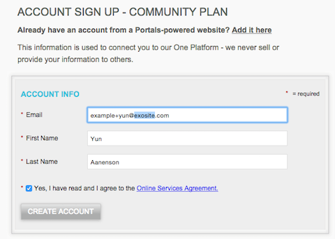

6. Once logged in, Go to the Devices page ([https://portals.exosite.com/manage/devices](https://portals.exosite.com/manage/devices)) and add a device

	1. Click on "+ Add Device"
	
	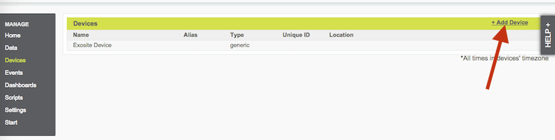
	
	2. Select "Select a supported device below."
	
	3. Select "Arduino Yún Compatible" device type from drop down list
	4. Click 'Continue' button.	
	
	
	
	3. **IMPORTANT**: Enter your WiFi MAC Address.  You can get this either from the Yún's web server page ('Set up your Yun' above) or if you run this sketch, it will print it out at boot time.  It should be in the format 00:11:AA:BB:22:CC (capital letters and use colons).  Note: If you use something other than your Yún's WiFi MAC Address, the device won't activate.
	4. Name your device, anything you want.  Leave the device location field empty, it is optional.
	5. Hit 'Continue' button.
	 
	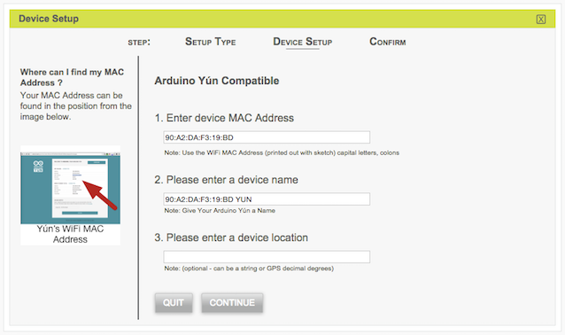
	6. Hit the 'Quit' button on the final window that says "Your Arduino Yún Compatible Device was successfully enabled with the CIK..."
	
	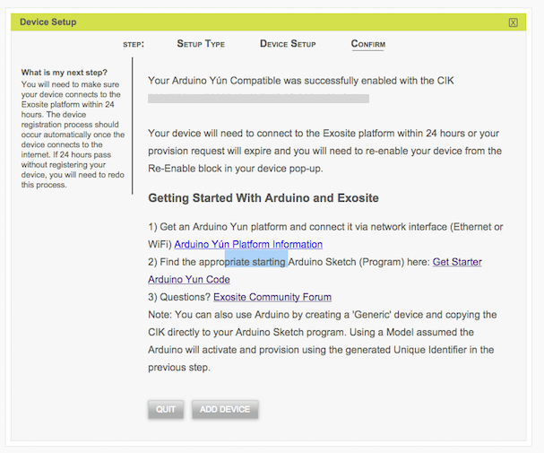
	
### Program the Yun

4. Open "File->Examples->arduino_exosite_library->ExoYunGettingStarted"

	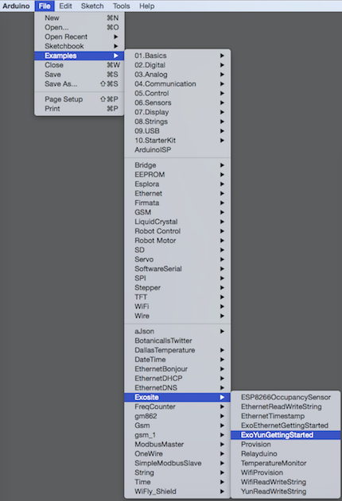
	
11. Power your Arduino Yún using the USB cable connected to your computer or using a power adapter.

12. Go to "Tools->Serial" to select the serial port or networking port your Arduino Yún board is connected to (both serial or over the network options work for the Yun)
   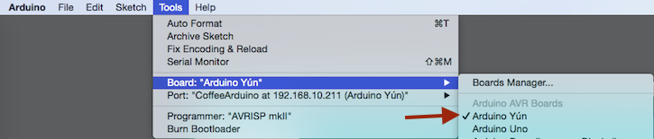

13. Go to "Tools->Board" to select the corresponding Arduino Yún board type
   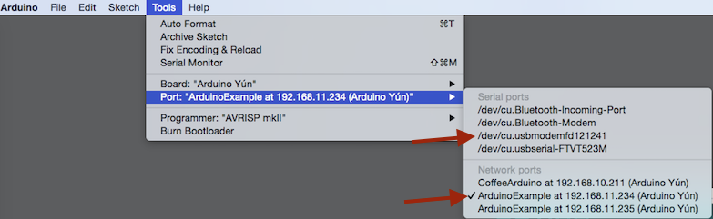 

14. In the Arduino software, compile and verify there are no errors

15. Upload the program to your board.
    
    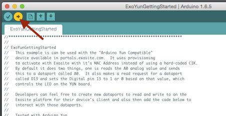 

15. Check the serial output to verify activation and communication with Exosite.  Also check your MAC Address.

    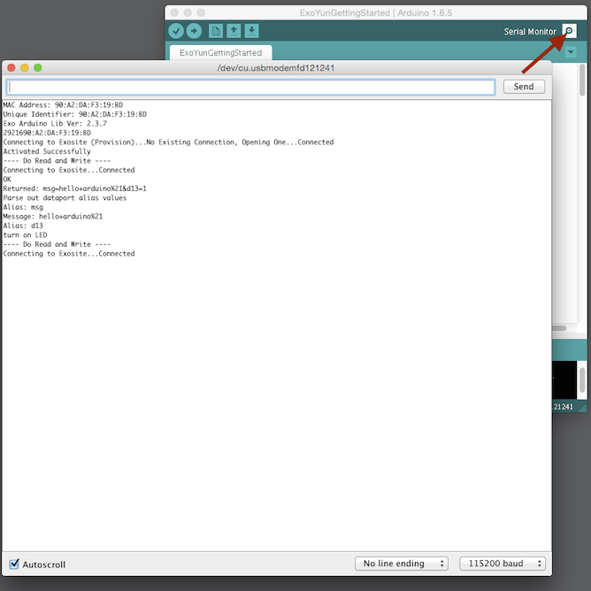 

16. When "Done uploading" is displayed, go to https://portals.exosite.com to see your data in the cloud!  Click on your device on the 'Devicest List' on the start page.  This will bring you to a product dashboard.  You can now create your own custom dashboards, add other data ports, data rules, alerts, and scripts.

    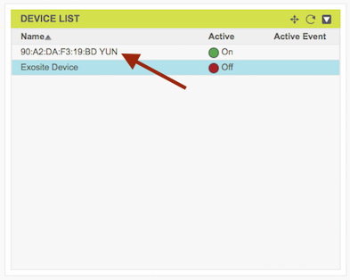 
    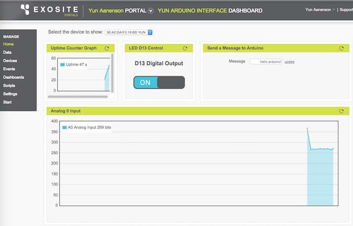 

##Notes
#### Help
If you are running into problems, please feel free to check out our [developer community forum](https://community.exosite.com/c/hardware-platforms) or use our [support site](https://support.exosite.com).

#### Using the Yún compared to Arduino with Ethernet Shield with Exosite
Exosite has created a separate reference Yún device type for a couple of reasons.
The Yún actually has MAC Adddresses programmed into the device, so this can be used 
for activation instead of the Arduino Compatible Ethernet example that generates a random unique identifier and you need to put this into your sketch.  For the Yún, you do not need to do this, it just uses it's WiFi MAC Address to activate.  The second reasons is the Yún has slightly different hardware available, most notably the Yún has D13 available to control the board LED.  When you use a regular Arduino with Ethernet shield, you lose D13 so providing an option to control the LED wouldn't make sense.

#### Security
The Arduino Networking Client Libraries such as the [Ethernet Library](https://www.arduino.cc/en/Reference/Ethernet) and [Yun Client Class](https://www.arduino.cc/en/Reference/YunBridgeLibrary) do not have built in support for Encrypted HTTP communication.  Exosite always recommends using encrypted communication and is working on ways to use encryption on Arduino devices in the future.  

